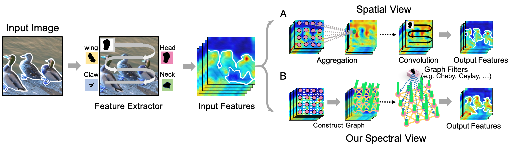

# Spectral Nonlocal Block

## Overview
Official implementation of the paper: Unifying Nonlocal Blocks for Neural Networks (ICCV'21)

## Spectral View of Nonlocal Block
Our work provide a novel perspective for the model design of non-local blocks called **the Spectral View of Non-local**. In this view, the non-local block can be seen as **operating a set of graph filters on a fully connected weighted graph**. Our spectral view can help to therorotivally anaylize exsiting non-local blocks and design novel non-local block with the help of graph signal processing (e.g. the graph neural networks).

## Spectral Nonlocal Block
This repository gives the implementation of Spectral Nonlocal Block (SNL) that is theoreotically designed with the help of first-order chebyshev graph convolution. The structure of the SNL is given below:

Two main differences between SNL and exisiting nonlocals, which make SNL can concern the graph spectral:
1) The SNL using a symmetrical affinity matrix to ensure that the graph laplacian of the fully connected weighted graph is diagonalizable.
2) The SNL using the normalized laplacian to conform the upper bound of maximum eigenvalue (equal to 2) for arbitrary graph structure.  

More novel nonlocal blocks defined with other type graph filters will release soon, for example Cheby Filter, Amma Filter, and the Cayley Filter.

## Getting Starte
### Requirements
PyTorch >= 0.4.1

Python >= 3.5

torchvision >= 0.2.1

termcolor >= 1.1.0

tensorboardX >= 1.9

opencv >= 3.4

### Classification
To train the SNL:
1. install the conda environment using "env.yml"
2. Setting --data_dir as the root directory of the dataset in "train_snl.sh"
3. Setting --dataset as the train/val dataset (cifar10/cifar100/imagenet)
4. Setting --backbone as the backbone type (we suggest using preresnet for CIFAR and resnet for ImageNet)
5. Setting --arch as the backbone deepth (we suggest using 20/56 for preresnet and 50 for resnet) 
6. Other parameter such as learning rate, batch size can be found/set in "train_val.py"
7. run the code by: "sh train_snl.sh"
8. the training log and checkpoint are saving in "save_model"

### Semantic Segmentation
We also give the module/config implementated for semantic segmentation based on [mmsegmentation framework][mmsegmentation_url], one can regist our SNL block and train our SNL for semantic segmentation (Cityscape) followed their steps:

1. preparing environment of [mmsegmentation framework][mmsegmentation_url]
2. Putting ''snl_head.py'' into ''mmsegmentation/mmseg/models/decode_heads''
3. registering our ''SNLHead'' by editing ''mmsegmentation/mmseg/models/decode_heads/\_\_init\_\_.py'' \
3-1. adding: ``from .snl_head import SNLHead \
3-2. adding ''SNLHead'' at the end of the list ''\_\_all\_\_'' 
4. putting ''configs/snl'' into ``mmsegmentation/configs''
5. putting ''configs/_base_/models/snl_r50-d8.py'' into ''mmsegmentation/configs/models''
7. run: \
``CUDA_VISIBLE_DEVICES=3 python tools/train_flops.py configs/snl/snl_r50-d8_512x1024_40k_cityscapes.py 
	--work-dir result_snl 
8. the training log and checkpoint are saving in "result_snl"

Note that our experiments is done with only a Nvidia 3090 GPU, if user want to use multi-gpu for training, please refer to [mmsegmentation framework][mmsegmentation_url].
### Citation

@InProceedings\{Lei_2021_ICCV, 
title = \{Unifying Nonlocal Blocks for Neural Networks\}, 
author = \{Zhu, Lei and She, Qi and Li, Duo and Lu, Yanye and Kang, Xuejing and Hu, Jie and Wang, Changhu\}, 
booktitle = \{IEEE International Conference on Computer Vision (ICCV)\}, 
month = \{October\}, 
year = \{2021\} 
\}

### Acknowledgement
This code and our experiments are conducted based on the release code of [CGNL][CGNL_url] / [mmsegmentation framework][mmsegmentation_url] / [3D-ResNet framework][3D-ResNet_url]. Here we thank for their remarkable works.

[3D-ResNet_url]: https://github.com/kenshohara/3D-ResNets-PyTorch
[mmsegmentation_url]: https://github.com/open-mmlab/mmsegmentation
[CGNL_url]: https://github.com/KaiyuYue/cgnl-network.pytorch

